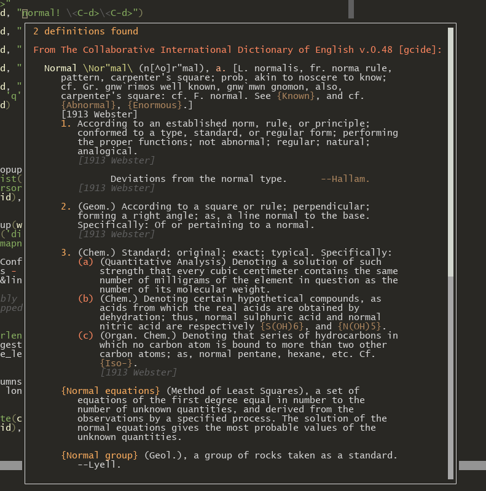

# Dict Popup

A simple plugin for the Linux command `dict` which shows the definitions in a popup.



## Install
Requires Vim v9.0 or above; Written in **vim9script**

### Command
```bash
sudo apt install dictd
# or
sudo dnf install dictd
```
```bash
# extra dictionaries
sudo apt install dict-jargon dict-vera
```
**Note:** Syntax only tested with gcide *(default)*, jargon and vera

### Plugin
* [vim-plug](https://github.com/junegunn/vim-plug):
  * `Plug 'Nealium/dict-popup.vim'`
* [Vundle](https://github.com/VundleVim/Vundle.vim):
  * `Plugin 'Nealium/dict-popup.vim'`
* Native Vim Packages:
  * `git clone https://github.com/Nealium/dict-popup.vim ~/.vim/pack/plugins/`

## Usage
ex command `:Dict {word}`, example `:Dict test`    

Can also be mapped, like:
```vim
nnoremap <leader>h <Plug>(dict_popup)
xnoremap <leader>h <Plug>(dict_popup)
```
When ran in *normal mode* it will run the command with the current word.    
When ran in *visual mode* it will only graph what is highlighted.    

### Popup Maps

| Key      | Equivalent   | Description      |
|----------|--------------|------------------|
| j        | \<C-d>       | Scroll Down      |
| k        | \<C-u>       | Scroll Up        |
| \<Space> | \<C-d>\<C-d> | Scroll Down 2x   |
| g        | gg           | Scroll to Top    |
| G        | G            | Scroll to Bottom |
| c        |              | Close            |
| q        |              | Close            |
| \<TAB>   |              | Close            |
| \<ESC>   |              | Close            |

# TODO
- [X] Syntax Highlighting
